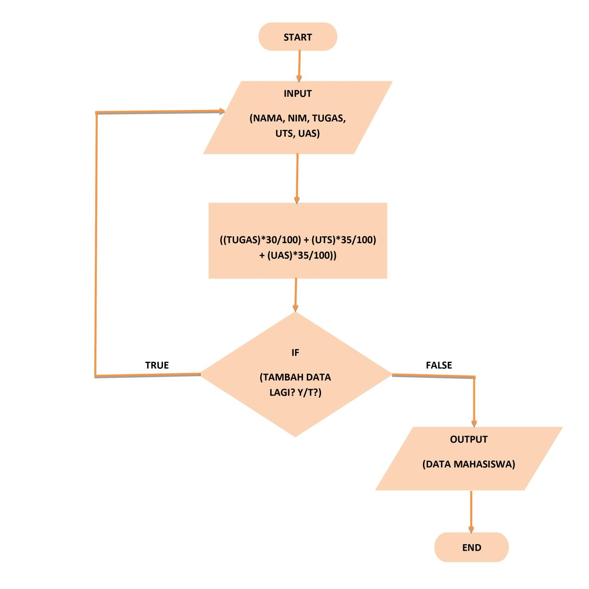

# Pratikum 4

## Program Menambahkan Data ke Dalam List

### A. Flowchart



### B. Program

![img] screenshot/4.png

### C. Penjelasan

1. Mendeklarasikan list data[] yang didalamnya berisi inputan (nama, nim, tugas, uts, uas, nilai akhir).

	```python
	data=[]
	```

2. Gunakan perulangan _while loop_ dengan nilai "True".
	
    ```python
	while True:
	```

3. Menginput nama, nim, tugas, uts dan uas.
	
    ```python
	nama=input("Nama Lengkap\t: ")
   	nim=input("NIM Mahasiswa\t: ")
  	tugas=int(input("Nilai Tugas\t: "))
   	uts=int(input("Nilai UTS\t: "))
    	uas=int(input("Nilai UAS\t: "))
	hitung=(int(tugas)*30/100)+(int(uts)*35/100)+(int(uas)*35/100)
	```

4. Untuk variable data, inputan akan ditambahkan ke dalam list dengan method `.append`.

	```python
    data.append([nama, nim, tugas, uts, uas, hitung])
    ```

5. Pada input <b>Tambah Data Lagi?</b> apabila jawaban “t” atau “T”, maka program akan berhenti dan akan menampilkan hasil daftar datanya.

	```python
	lanjut=input("Tambah Data Lagi?(y/t)")
	if lanjut=="t" or lanjut=="T":
	```

6. Menampilkan hasil data yang telah diinput.

	```python
	print("Data Mahasiswa")
        	print(65*"=")
        	print("| {0:^10} | {1:^10} | {2:^6} | {3:^4} | {4:^4} | {5:^12} |".format("NAMA", "NIM", "TUGAS", "UTS", "UAS", "NILAI AKHIR"))
        	print(65*"=")
	        for x in data:
            		print("| {0:>10} | {1:>10} | {2:>6} | {3:>4} | {4:>4} | {5:>12} |".format(x[0],x[1],x[2],x[3],x[4],x[5]))
            		print(65*"=")
        	else:
            		break
	```

7. Gunakan ` print(65*"=")` untuk membuat header dan footer agar terlihat lebih rapih, fungsi `65*”=”` adalah untuk membuat “=” sebanyak 65 buah sebagai garis.

	```python
	print(65*"=")
	```

8. Untuk membuat isi tabel sesuai keinginan dengan format string.

	```python
	print("| {0:^10} | {1:^10} | {2:^6} | {3:^4} | {4:^4} | {5:^12} |".format("NAMA", "NIM", "TUGAS", "UTS", "UAS", "NILAI AKHIR"))
	```

	```python
	print("| {0:>10} | {1:>10} | {2:>6} | {3:>4} | {4:>4} | {5:>12} |".format(x[0],x[1],x[2],x[3],x[4],x[5]))
	```

### D. Output

![img]

## Mengakses List

### A. Program

![img]

### B. Penjelasan

1. Membuat list dengan value (nilai) yang diinginkan. Dalam variable <b>daftar</b> tersimpan nilai berupa array list yang didalamnya terdapat 6 elemen. Dimulai dari elemen pertama atau indeks ke-0 yaitu “orchid” dan diakhiri dengan elemen ke-6 atau indeks ke-5 yaitu “3”.

	```python
	daftar=['orchid', 'jasmine', 'rose', 1, 2, 3]
    ```

2. Menampilkan semua elemen yang terdapat pada list yang telah dibuat
	
    ```python
    print("List:", daftar)
	```

3. Untuk menampilkan elemen ketiga pada sebuah list, gunakan `daftar[3]`. <b>daftar</b> adalah nama variable dari list yang akan dibuat, sedangkan <b>[3]</b> adalah elemen ketiga karena  kita akan menampilkan elemen yang ketiga. <b>Note : Nomor indeks list selalu dimulai dari nol.</b>
	
    ```python
	print("Elemen ke-3 :", daftar[3])
	```

4. Jika ingin mengambil elemen kedua sampai keempat, gunakan ` daftar[2:4]`.
	```python
	print("Elemen ke-2 sampai elemen ke-4 :", daftar[2:4])
	```

5. Dan jika ingin mengambil elemen terakhir, maka gunakan ` daftar[-1]`
	
    ```python
	print("Elemen Terakhir :", daftar[-1])
	```

### C. Output

![img]

## Mengubah List

### A. Program

![img]

### B. Penjelasan

1. Membuat list dengan nilai yang diinginkan
	
    ```python
	daftar=['orchid', 'jasmine', 'rose', 1, 2, 3]
    print("List:", daftar)
	```

2. Untuk mengubah elemen ke-4  dengan nilai yang lain, gunakan `daftar[4]=0`.

	```python
	daftar[4]=0
    print(daftar)
	```

3. Jika ingin mengubah elemen ke-4 sampai dengan elemen terakhir, gunakan `daftar[4:]=[4, 5]`.
	
    ```python
	daftar[4:]=[4, 5]
    print(daftar)
	```

### C. Output

![img]

## Menambah List

### A. Program

![img]

### B. Penjelasan

1. Buat list dengan variable X dan Y dengan nilai yang diinginkan.
	
    ```python
	x=['A', 'B', 'C', 'D']
    y=['E', 'F', 'G', 'H']
    print("List X :", x, "\nList Y :", y)
    ```

2. Untuk mengambil 2 bagian dari list X dan tambahkan di list Y, gunakan `y.append(x[0:2])`.

	```python
	y.append(x[0:2])
    print(y)
	```

3. Menambahkan list Y dengan nilai string.

	```python
	y.append('I')
    print(y)
	```

4. Menambahkan 3 nilai ke dalam list Y.
	```python
	print(y+['J', 'K', 'L'])
    print()
    ```

5. Untuk menggabungkan list Y dan list X, gunakan operator “+”.
	
    ```python
	print(x+y)
	```

### C. Output

![img]

## Sekian Terimakasih
